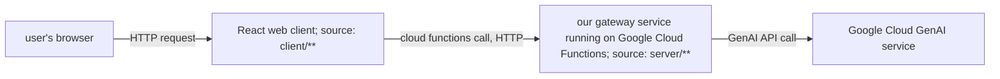

# Components

# Configuration

Environment files are in Dotenv format, that is each line contains an assignment like `VITE_GATEWAY_SERVICE_URL=http://localhost:5566`.

Client (React web page) configuration:

* `client/.env.local`
    * `VITE_GATEWAY_SERVICE_URL`: gateway service address to use with locally deployed web client, e.g. `http://localhost:5566`
* `client/.env.production`
    * `VITE_GATEWAY_SERVICE_URL`: gateway service address to use with web client deployed on Github pages, e.g. `https://us-central1-myGoogleCloudProject.cloudfunctions.net/testFn`

Server (our gateway service) configuration:

* `server/.env.development.local`
    * `VITE_GEMINI_API_KEY`: Google Cloud API key for GCP GenAI service, used with locally deployed gateway service
* `server/.env`
    * `VITE_GEMINI_API_KEY`: Google Cloud API key for GCP GenAI service, used with gateway service deployed to Google Cloud Functions
* `server/.env.yaml`: keep this synchronized with `server/.env` but in YAML format, e.g. `"VITE_GEMINI_API_KEY": "xyz"`
